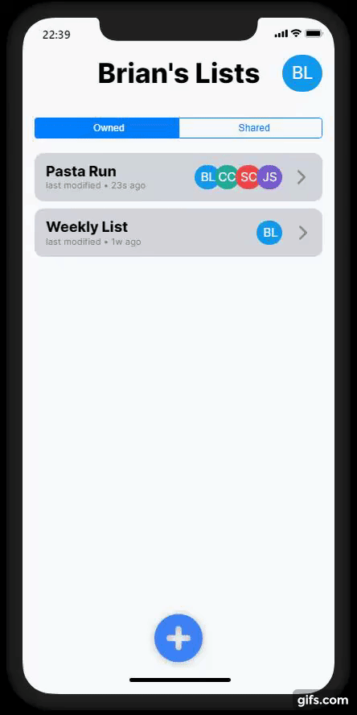
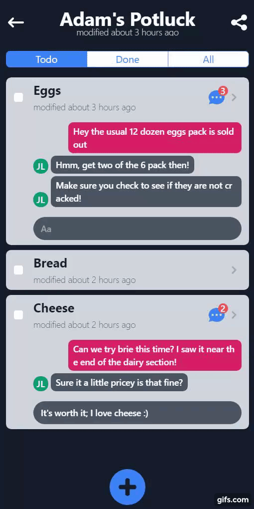

  <h3 align="center"></h3>

  

    Basket: A realtime, collaborative shopping list
     
    <a href="https://basket-ebl.vercel.app/"><strong>Demo »</strong></a>
     
     
    <a href="https://blog.engbrianlee.vercel.app/basket-a-real-time-collaborative-shopping-list">Blog Post</a>
    &bull;
    <a href="LICENSE.md">License (MIT)</a>
  

## What is it?

> Basket is a realtime, collaborative shopping list that helps groups of people organize their shopping runs.

_Imagine this scenario_: you're planning a grocery store run to get some items. You ask your family members what they want and hordes of text messages hit your inbox. You arrive at the store and open whatever chat app your family members used for their requests and start mentally checking off items until you inevitably hit a roadblock - you can't find a certain item 😱!

You text back, asking if "x" brand is a suitable replacement and get into a discussion. Images are sent, more text messages flood your inbox, and by the end of the ordeal, your chat log is a jumbled mess of images and text. But you're still not done! That was just a single item, time to wade through this jumbled mess to find out the next item to complete.

---

Basket alleviates this issue by **providing structure to how you communicate about your shopping list.**

Items are organized as you would expect from a shopping list app but the real power comes from **the ability to communicate in realtime**.

There's **no app to install** as it **runs on any browser** and **sharing a list is as simple as sharing a uniquely generated link**.

## Features

- **Authentication** (managed by Auth0)
- **Caching** (never fetches redudant data)
- **Optimistic Responses** (UI updates the moment you perform an action, resulting in a snappy user experience)
- **Network Retries** (won't crash on unstable connections)
- **Gestures** (swipe to edit/delete)
- **Dark Mode** (a VERY important feature 😛)

You can see how these features evolved and were integrated through the [project's Github commits](https://github.com/engbrianlee/basket/commits/master).

## Tech Stack

After an initial project ideation and planning phase, I was able to develop the entire app in approximately 2 weeks due to these amazing technologies:

### Frontend

- **React (Create React App)**: Frontend Framework
- **TailwindCSS**: CSS
- **Apollo Client**: GraphQL Client

### Backend

- **Hasura**: GraphQL Engine, Authorization, Serverless Function Integration

### Authentication

- **Auth0**: Authentication

### Testing
- **Storybook**: Component testing
- **Cypress.io**: For E2E & Integration testing

## Conclusion & Disclaimer

> Disclaimer: Do not use this app to store any sensitive information; it is for DEMO purposes only.

Check out the [demo](BASKET_LIVE_SITE_LINK).

There are still a lot of core features to complete:

- Push Notifications
- Better UX/UI for realtime capabilities
- Better testing
- [Many, many more](https://github.com/engbrianlee/basket/issues)
